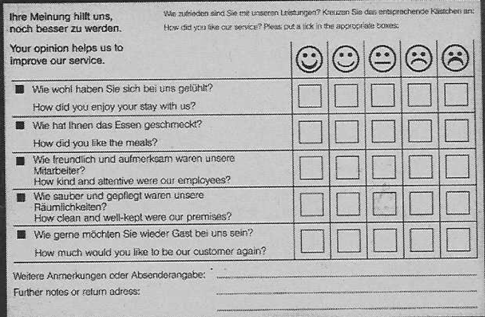
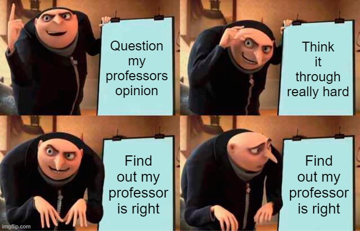

During my customer relationship lecture today, our professor presented us examples of badly designed surveys. One of the examples piqued my interest since I disagreed with my professor:
<!--more-->

His critique was about questions three and four in the image above. They are double-barreled. That means they are two questions in one.
"How kind and attentive were our employees?" asks two questions:
1. How kind were our employees?
2. How attentive were our employees?

There are two cases in which this type of question leads to confusion and/or inaccurate results:
1. Many customers answer with a negative emoji. Now we don't know whether the employees are unfriendly, inattentive or both.
2. A customer thinks they were inattentive and friendly or attentive and unfriendly. Now the customer doesn't know how to answer the question and is confused.

I initially thought: "Those are made-up problems. If the question gets negative answers, we can investigate further what the problem with our staff is. And what customer would think: 'This friendly service person was really inattentive'? If somebody doesn't recognize my needs as a customer, I don't feel treated friendly. So that double-barreled question is perfectly fine!"

Double-barreled questions can't be as bad as my professor says, right? Let's explore the alternatives.

# Alternatives to double-barreled questions
1. Ask both questions separately
- We will get precise answers for both questions and we avoid confusion
- We need more space on our questionnaire
- Two questions create more mental load than one question
2. Ask only for the more important aspect
- We will get precise information on the aspect we ask for
- We don't get information about the aspect we dropped
- We create less mental load than with a double-barreled question
3. Ask a generalized question that covers both aspects (i.e. "How satisfied were you with our employees?")
- We will get more insight about the general opinion of the respondent
- We will have a harder time troubleshooting in case of a negative answer
- We won't get insights about the specific aspects

I think the mental complexity of questionnaires is a whole topic to explore on its own. I will explore that in a future article.
As we can see, the alternatives come with their own pros and cons. Those types of questions would all solve the problem of the respondent being confused. Let's have a closer look at the specificity of those questions.

# Information loss due to specificity
In regard to the specificity of our questions, there are two ways in which we can lose information.
1. We ask too specific. Maybe the customer is satisfied with the aspect we asked for but has some valuable feedback about an aspect we didn't ask for. In our example, if we ask whether the staff was friendly, we might miss on the point that they touch the food with unwashed hands.
2. We ask too broad. We will find out that the customer is unhappy about something related to our staff. But we will not know that they are friendly and attentive. And we don't learn about the unwashed hands either.

To find out about the unwashed hands, we need a freetext answer. Freetext answers have the potential of revealing aspects we didn't come up with when creating the survey. Instead of using our double-barreled question, we could ask:\
How satisfied were you with our employees? [ :) ] [ :( ] \
If unsatisfied, why? ____________________________________

There are two disadvantages about freetext answers:
1. They are less likely to be answered compared to checkboxes
2. They are more difficult to evaluate

# When are double-barreled questions bad?
Double-barreled questions should be avoided when we have a better alternative. While this statement might seem obvious, I think it's worth it to stop and really think about whether you truly need a double-barreled question. Maybe a more specific or broader question is more target-oriented.

Another case in which we shall avoid double-barreled questions is when the two aspects of the questions are not closely related. When the aspects are closely related, there is a high chance that the respondent will have the same feelings about both aspects of the question. If they are not related, like "How satisfied were you with our food and the kindness of the employees?" there is a good chance that the customer wants to give a differentiated answer.

# When are double-barreled questions okay?
There is a very specific (and quite constructed) case in which double-barreled questions are okay:
- The resources are limited (i.e., we do not have enough space on our questionnaire to ask two questions instead of one)
- Both aspects of the questions are equally important to the surveying party, and none of both shall be dropped
- The questioning party doesn't want to ask a broader question because they want to focus on these two aspects in particular
- The two aspects of the question are so closely related that it's unlikely that the respondent will want to answer differentiated

While the first and last points are fulfilled in the given example, the second and third are open to speculation.

I cannot come up with a scenario where somebody would want to ask explicitly for exactly two specific aspects that are so closely related that respondents probably don't want to differentiate their answer on these aspects.

To wrap this up, there are potent alternatives to double-barreled questions. When designing questions for a questionnaire, we should always have our target in mind. And when we create a double-barreled question, we should stop and think about whether it is the best alternative. \
It is likely that the double-barreled question my professor criticized is not necessary and that there are better alternatives, like asking for one specific aspect or broadening the question.

My professor was right once more.

